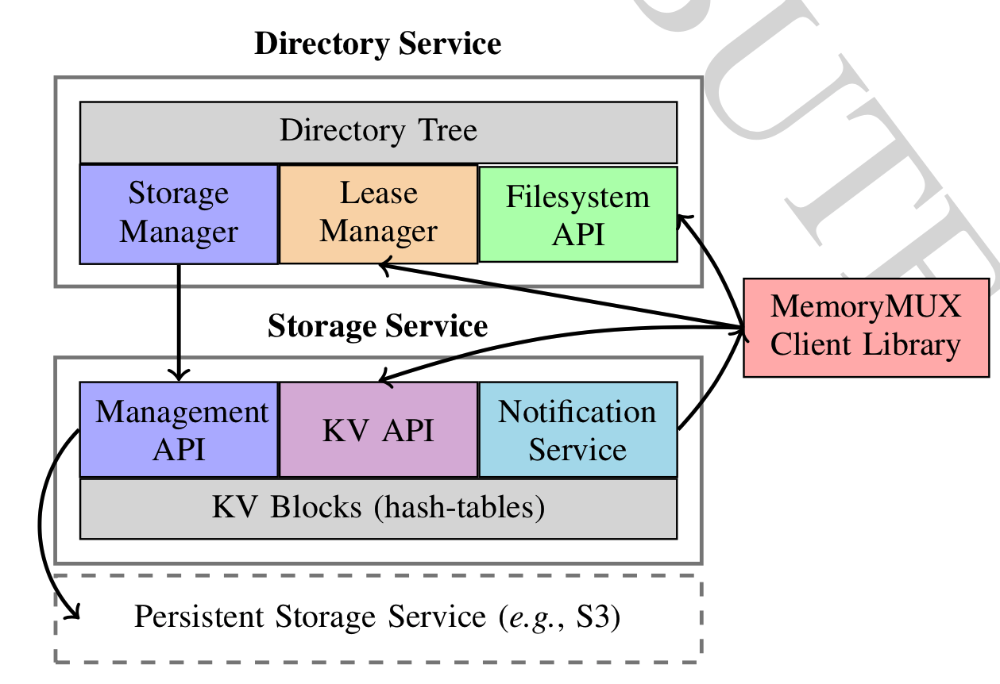

# Quick Start

In this Quick Start, we will take a look at how to download and setup Jiffy,
load some sample data, and query it.

TODO: need accurate usage description

## Pre-requisites

Before you can install Jiffy, make sure you have the following prerequisites:

- MacOS X, CentOS, or Ubuntu(16.04 or later)
- C++ compiler that supports C++11 standard (e.g., GCC 5.3 or later)
- CMake 3.9 or later

For Python client, you will additionally require:
- Python 2.7 or later, 3.6 or later
- Python Packages: setuptools

For java client, you will additionally require:
TODO: accurate

- Java 1.7 or later

## Download and Install

To download and install Jiffy, use the following commands:
```bash
git clone https://github.com/ucbrise/jiffy.git
cd jiffy
mkdir -p build
cd build
cmake ..
make -j && make test && make install
```
For macOS Mojave users, the headers are no longer installed under `/usr/include` by default.
Please run the following command in terminal and follow the installation instructions before building:

```bash
open /Library/Developer/CommandLineTools/Packages/macOS_SDK_headers_for_macOS_10.14.pkg
```

## Setup cluster

### Diagram

TODO needs to be replaced with proper image




### Start server

After installation, we can first start a directory server by running:

```bash
directoryd
```

We can then start multiple storage servers in different port configurations by running:

```bash
storaged --config jiffy1.conf
storaged --config jiffy2.conf
...
```

We have to start the directory server before the storage server because the storage will find it's corresponding directory server to advertise its blocks right after start up.


### Configuration files

A sample configuration file for Jiffy could be find under jiffy/conf. Users can specify their own configuration parameters to directoryd and storaged executables as follows:

```bash
directoryd --config jiffy.conf

storaged --config jiffy.conf
```


## Using Jiffy

Once the directory server and storage server are running, you can store and query using Python or Java client APIs.


### Client interface

Setup Jiffy Python client with the following commands:

```bash
cd jiffy/pyjiffy/
python setup.py build
python setup.py install
```

Setup Jiffy Java client with the following commands:
```bash
TODO
```

We first create a new client connection to the directory server.

```python tab="Python"
from jiffy import JiffyClient
# Connect the directory server with the corresponding port numbers
client = JiffyClient("127.0.0.1", 9090, 9091)
```

```java tab="Java"
TODO
```

The first argument to the JiffyClient constructor corresponds to the server hostname, while the second and third argument correspond to the directory server port and lease server port.

We could then create a file and also back it up in persistent storage. The backing path on persistent storage, the number of blocks, the replication chain length and also the flag are the four arguments that can be specified when creating a file. 
TODO meanings of the flag

```python tab="Python"

hash_table = client.create("/a/file.txt", "local://tmp", 1, 1, 0)

hash_table = client.open("/a/file.txt")

hash_table = client.open_or_create("/a/file.txt", "local://tmp", 1, 1, 0)
```

```java tab="Java"
TODO
```


The open and create operations will return a data structure client, from which we could achieve specific operations on the file data.


The Jiffy client could also sychronize its data with the persistent storage.The operations are as follows:

```python tab="Python"
# Synchronize file data with persistent storage
client.sync("/a/file.txt", "local://tmp")

# Write dirty file back to persistent storage and clear the file
client.dump("/a/file.txt", "local://tmp")

# Load file from persistent storage
client.load("/a/file.txt", "local://tmp")
```

```java tab="Java"
TODO
```


The Jiffy client could also listen after a path and receive notification by using the subscription client.

```python tab="Python"
subscription = client.listen("/a/file.txt")

subscription.subscribe("put")
```

```java tab="Java"
TODO
```


We could use the subscription client to check whether it has received notification and get the notification.

TODO: not able to realize and in chain_module.cpp there is some code that needs fix

```python tab="Python"
while not subscription.has_notification():
	notify = subscription.get_notification()
```

```java tab="Java"
TODO
```


After operating on the file, the client could also close or remove the file and disconnect the server.

```python tab="Python"
client.close("/a/file.txt")
client.remove("/a/file.txt")
client.disconnect()
```

```java tab="Java"
TODO
```


### Hash table API 

After file creation, user can achieve multiple commands with the hash table client.


We can put key-value pairs in the storage server and also get them in byte-strings.

```python tab="Python"
hash_table.put(b"key", b"value")
if hash_table.exists(b"key") == b'true':
	hash_table.get(b"key")
```

```java tab="Java"
TODO
```


We can also update or remove specific key-value pairs as following:

```python tab="Python"
hash_table.update(b"key", b"value")
hash_table.remove(b"key")
```

```java tab="Java"
TODO
```


All the operation can be done in batches as following:

```python tab="Python"
args = [b"key1", b"value1", b"key2", b"value2"]
args_key = [b"key1", b"key2", b"key3"]
# Put in batches
response = hash_table.multi_put(args)
# Get in batches
response = hash_table.multi_get(args_key)
# Check exists in batches
response = hash_table.multi_exists(args_key)
# Update in batches
response = hash_table.multi_update(args)
# Remove in batches
response = hash_table.multi_remove(args_key)

```

```java tab="Java"
TODO
```

